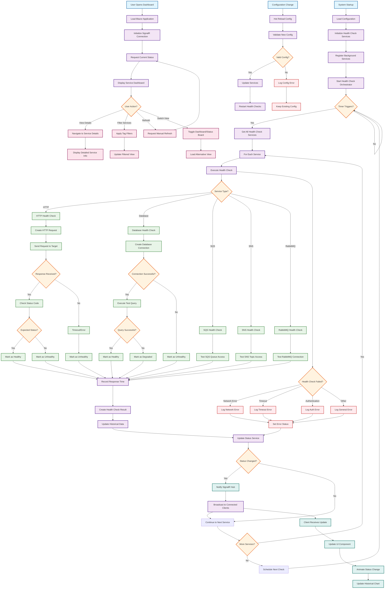

# Activity Diagram - Health Monitor System

## Health Monitoring Process Flow

This diagram shows the activities and process flow within the Health Monitor system, including background health checking, real-time updates, and user interactions.

## Process Descriptions

### 1. System Initialization
- **Configuration Loading**: Read health check configurations from JSON file
- **Service Registration**: Register all health check services with dependency injection
- **Background Service**: Start the orchestrator as a hosted background service
- **Timer Setup**: Initialize periodic health check scheduling

### 2. Health Check Orchestration
- **Scheduled Execution**: Timer-based triggering of health check cycles
- **Service Discovery**: Enumerate all registered health check services
- **Parallel Execution**: Execute health checks concurrently where possible
- **Result Aggregation**: Collect and process all health check results

### 3. Service-Specific Health Checks

#### HTTP Health Checks
1. Construct HTTP request with configured parameters
2. Send request to target endpoint
3. Evaluate response status code and timing
4. Handle network errors and timeouts
5. Record success/failure with response time

#### Database Health Checks
1. Establish database connection
2. Execute test query or connection validation
3. Measure connection and query response times
4. Classify as healthy, degraded, or unhealthy
5. Properly dispose of connections

#### Message Queue Health Checks
1. **SQS**: Test queue access and permissions
2. **SNS**: Verify topic access and publishing capabilities
3. **RabbitMQ**: Test connection and exchange availability
4. Handle authentication and authorization errors

### 4. Status Management
- **Result Processing**: Transform health check results into status objects
- **Historical Tracking**: Maintain rolling window of historical status data
- **Change Detection**: Identify status transitions for notification
- **State Persistence**: Maintain current status in memory cache

### 5. Real-time Communication
- **SignalR Broadcasting**: Push status updates to connected clients
- **Connection Management**: Handle client connections and disconnections
- **Group Management**: Support for targeted notifications (if implemented)
- **Fallback Handling**: Graceful degradation when WebSocket is unavailable

### 6. User Interface Interactions

#### Dashboard Navigation
- **Initial Load**: Establish SignalR connection and load current status
- **Real-time Updates**: Receive and apply status updates without page refresh
- **Interactive Features**: Filtering, sorting, and detailed views
- **Responsive Design**: Adapt to different screen sizes and devices

#### User Actions
- **Service Details**: Drill down into individual service health data
- **Filtering**: Apply tag-based filters to focus on specific services
- **Manual Refresh**: Force immediate status update
- **View Switching**: Toggle between dashboard and status board layouts

### 7. Error Handling and Resilience

#### Health Check Errors
- **Network Failures**: Handle connectivity issues and DNS resolution
- **Timeouts**: Manage request timeouts and circuit breaking
- **Authentication**: Handle credential and permission issues
- **Service Unavailability**: Graceful handling of temporarily unavailable services

#### System Resilience
- **Configuration Validation**: Prevent invalid configurations from breaking the system
- **Hot Reloading**: Support configuration changes without system restart
- **Logging**: Comprehensive logging for debugging and monitoring
- **Graceful Degradation**: Continue monitoring available services when others fail

### 8. Configuration Management
- **Dynamic Updates**: Support for runtime configuration changes
- **Validation**: Ensure configuration integrity before applying changes
- **Rollback**: Ability to revert to previous working configuration
- **Environment-specific**: Support for different configurations per environment

## Key Activities and Decision Points

### Critical Decision Points
1. **Service Type Selection**: Route to appropriate health check implementation
2. **Status Change Detection**: Determine if notification is required
3. **Error Classification**: Categorize failures for appropriate handling
4. **Configuration Validation**: Ensure safe application of configuration changes

### Parallel Activities
- Multiple health checks execute concurrently
- Real-time updates occur independent of health check cycles
- User interactions happen asynchronously from background processes
- Configuration management operates independently

### Error Recovery
- Automatic retry mechanisms for transient failures
- Circuit breaker pattern for consistently failing services
- Fallback to cached status when real-time updates fail
- Graceful degradation of functionality during partial system failures

## Performance Considerations
- **Concurrent Execution**: Health checks run in parallel to minimize total execution time
- **Caching**: Status results cached to reduce load during high-traffic periods
- **Efficient Broadcasting**: SignalR optimizations for large numbers of connected clients
- **Resource Management**: Proper disposal of connections and resources