# C4 Component Diagram - Health Monitor Web Application

## Component Architecture

This diagram shows the internal components within the Health Monitor Blazor Web Application container.

```mermaid
C4Component
    title Component Diagram - Health Monitor Web Application

    Person(users, "Users", "DevOps, SRE, Developers")

    Container_Boundary(webApp, "Blazor Web Application") {
        Component(appComponent, "App Component", "Blazor Component", "Root application component and routing")
        Component(dashboardPage, "Dashboard Page", "Blazor Page", "Main dashboard view with service details")
        Component(statusBoardPage, "Status Board Page", "Blazor Page", "Grid view of all service statuses")
        Component(layoutComponents, "Layout Components", "Blazor Components", "Shared layout and navigation")
        
        Component(signalRClient, "SignalR Client", "SignalR Connection", "Manages real-time connections to hub")
        Component(statusManager, "Status Manager", "Client Service", "Manages status data and state")
        
        Component(serverComponents, "Server Components", "Blazor Server", "Server-side rendering components")
        Component(wasmComponents, "WASM Components", "Blazor WebAssembly", "Client-side components")
    }

    Container_Boundary(serverSide, "Server-Side Services") {
        Component(notificationHub, "Notification Hub", "SignalR Hub", "Broadcasts status updates")
        Component(statusService, "Status Service", "Service Layer", "Status aggregation and management")
        Component(configService, "Configuration Service", "Service Layer", "Loads and manages configurations")
        Component(healthCheckOrchestrator, "Health Check Orchestrator", "Background Service", "Coordinates health checks")
        
        Component(httpHealthCheck, "HTTP Health Check", "Health Check Service", "Performs HTTP health checks")
        Component(dbHealthCheck, "DB Health Check", "Health Check Service", "Performs database connectivity checks")
        Component(sqsHealthCheck, "SQS Health Check", "Health Check Service", "Performs SQS health checks")
        Component(snsHealthCheck, "SNS Health Check", "Health Check Service", "Performs SNS health checks")
        Component(rabbitMqHealthCheck, "RabbitMQ Health Check", "Health Check Service", "Performs RabbitMQ health checks")
    }

    ComponentDb(configFile, "Configuration File", "JSON", "healthcheckconfig.json")
    
    System_Ext(monitoredServices, "Monitored Services", "External services being monitored")

    %% User interactions
    Rel(users, dashboardPage, "Views detailed service information", "HTTPS")
    Rel(users, statusBoardPage, "Views service status grid", "HTTPS")

    %% Internal component relationships
    Rel(appComponent, dashboardPage, "Routes to", "Component Reference")
    Rel(appComponent, statusBoardPage, "Routes to", "Component Reference")
    Rel(appComponent, layoutComponents, "Uses", "Component Reference")

    Rel(dashboardPage, signalRClient, "Subscribes to real-time updates", "SignalR")
    Rel(statusBoardPage, signalRClient, "Subscribes to real-time updates", "SignalR")
    Rel(dashboardPage, statusManager, "Gets status data", "Service Call")
    Rel(statusBoardPage, statusManager, "Gets status data", "Service Call")

    Rel(signalRClient, notificationHub, "Connects for real-time updates", "WebSocket")
    Rel(statusManager, statusService, "Requests status data", "HTTP API")

    %% Server-side component relationships
    Rel(notificationHub, statusService, "Gets status for broadcasting", "Service Call")
    Rel(healthCheckOrchestrator, configService, "Gets health check configurations", "Service Call")
    Rel(configService, configFile, "Reads configuration", "File I/O")

    %% Health check orchestration
    Rel(healthCheckOrchestrator, httpHealthCheck, "Triggers HTTP checks", "Service Call")
    Rel(healthCheckOrchestrator, dbHealthCheck, "Triggers DB checks", "Service Call")
    Rel(healthCheckOrchestrator, sqsHealthCheck, "Triggers SQS checks", "Service Call")
    Rel(healthCheckOrchestrator, snsHealthCheck, "Triggers SNS checks", "Service Call")
    Rel(healthCheckOrchestrator, rabbitMqHealthCheck, "Triggers RabbitMQ checks", "Service Call")

    %% Health check execution
    Rel(httpHealthCheck, monitoredServices, "Performs HTTP health checks", "HTTP")
    Rel(dbHealthCheck, monitoredServices, "Tests database connectivity", "TCP/SQL")
    Rel(sqsHealthCheck, monitoredServices, "Checks SQS queues", "HTTPS/AWS API")
    Rel(snsHealthCheck, monitoredServices, "Checks SNS topics", "HTTPS/AWS API")
    Rel(rabbitMqHealthCheck, monitoredServices, "Checks RabbitMQ", "AMQP")

    %% Status reporting
    Rel(httpHealthCheck, statusService, "Reports HTTP check results", "Service Call")
    Rel(dbHealthCheck, statusService, "Reports DB check results", "Service Call")
    Rel(sqsHealthCheck, statusService, "Reports SQS check results", "Service Call")
    Rel(snsHealthCheck, statusService, "Reports SNS check results", "Service Call")
    Rel(rabbitMqHealthCheck, statusService, "Reports RabbitMQ check results", "Service Call")

    %% Hybrid rendering
    Rel(serverComponents, wasmComponents, "Interoperates with", "Blazor Interop")

    UpdateElementStyle(dashboardPage, $fontColor="white", $bgColor="blue", $borderColor="navy")
    UpdateElementStyle(statusBoardPage, $fontColor="white", $bgColor="blue", $borderColor="navy")
    UpdateElementStyle(signalRClient, $fontColor="white", $bgColor="orange", $borderColor="darkorange")
    UpdateElementStyle(notificationHub, $fontColor="white", $bgColor="orange", $borderColor="darkorange")
    UpdateElementStyle(statusService, $fontColor="white", $bgColor="purple", $borderColor="darkpurple")
    UpdateElementStyle(healthCheckOrchestrator, $fontColor="white", $bgColor="green", $borderColor="darkgreen")
```

## Component Responsibilities

### Frontend Components

#### App Component
- **Technology**: Blazor Component
- **Purpose**: Root application component
- **Responsibilities**:
  - Application routing
  - Global state management
  - Authentication (if implemented)
  - Error boundary handling

#### Dashboard Page
- **Technology**: Blazor Page Component
- **Purpose**: Detailed service monitoring view
- **Features**:
  - Service detail cards
  - Historical data visualization
  - Real-time status updates
  - Interactive filtering and searching

#### Status Board Page
- **Technology**: Blazor Page Component
- **Purpose**: High-level service overview
- **Features**:
  - Grid layout of service statuses
  - Color-coded status indicators
  - Quick status overview
  - Tag-based filtering

#### Layout Components
- **Technology**: Blazor Layout Components
- **Purpose**: Shared UI structure
- **Components**:
  - Main layout wrapper
  - Navigation menu
  - Header and footer
  - Responsive design elements

### Client Services

#### SignalR Client
- **Technology**: SignalR Client Connection
- **Purpose**: Real-time communication
- **Features**:
  - WebSocket connection management
  - Event subscription handling
  - Connection state management
  - Automatic reconnection

#### Status Manager
- **Technology**: Client-side Service
- **Purpose**: Status data management
- **Features**:
  - Local status caching
  - Data transformation
  - State synchronization
  - Event dispatching

### Rendering Components

#### Server Components
- **Technology**: Blazor Server
- **Purpose**: Server-side rendering
- **Features**:
  - Initial page rendering
  - SEO optimization
  - Reduced client load
  - Server-side state management

#### WASM Components
- **Technology**: Blazor WebAssembly
- **Purpose**: Client-side interactivity
- **Features**:
  - Rich client interactions
  - Offline capabilities
  - Performance optimization
  - Client-side calculations

### Backend Components

#### Notification Hub
- **Technology**: SignalR Hub
- **Interface**: `INotificationClient`
- **Methods**:
  - `ReceiveAllNotification(Service[] services)`
  - `ReceiveNotification(Service service)`
- **Features**:
  - Connection lifecycle management
  - Broadcast messaging
  - Group management
  - Scaling support

#### Status Service
- **Technology**: .NET Service
- **Purpose**: Central status coordination
- **Methods**:
  - `GetServices()`: Returns current service status array
- **Features**:
  - Status aggregation
  - Historical data management
  - Change detection
  - Performance metrics

#### Configuration Service
- **Technology**: .NET Service
- **Purpose**: Configuration management
- **Features**:
  - JSON configuration loading
  - Hot configuration reload
  - Validation and schema checking
  - Environment-specific configurations

#### Health Check Services
- **Purpose**: Service-specific health checking
- **Common Interface**: `IHealthCheckService`
- **Implementations**:
  - **HTTP**: REST API health checks
  - **Database**: Connection and query testing
  - **SQS**: Queue availability and permissions
  - **SNS**: Topic access and publishing
  - **RabbitMQ**: Connection and exchange testing

## Data Flow Patterns

### Real-time Update Flow
1. Health check services execute checks
2. Results sent to Status Service
3. Status Service detects changes
4. Notification Hub broadcasts to clients
5. SignalR Client receives updates
6. Status Manager updates local state
7. UI components re-render automatically

### Initial Load Flow
1. User navigates to dashboard
2. Server components render initial page
3. SignalR Client establishes connection
4. Notification Hub sends current status
5. WASM components hydrate for interactivity
6. Real-time updates begin flowing

### Configuration Flow
1. Configuration Service loads JSON config
2. Health Check Orchestrator reads configurations
3. Individual health check services are configured
4. Scheduled checks begin execution
5. Status data flows to frontend components