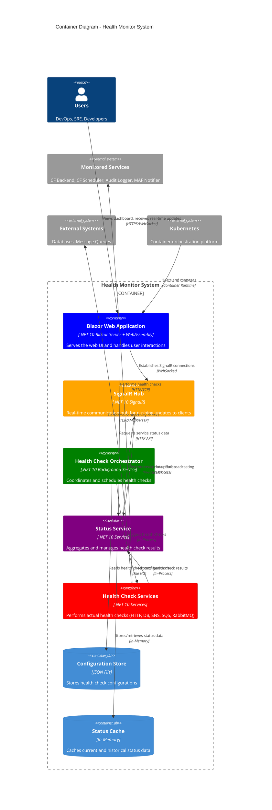

# C4 Container Diagram - Health Monitor System

## Container Architecture

The Health Monitor system is composed of several containers that work together to provide real-time health monitoring capabilities.

## Container Responsibilities

### Web Application (Blazor)
- **Technology**: .NET 10 Blazor Server + WebAssembly
- **Purpose**: User interface and presentation layer
- **Features**:
  - Dashboard and status board views
  - Real-time UI updates via SignalR
  - Responsive design with Tailwind CSS
  - Both server-side and client-side rendering

### SignalR Hub
- **Technology**: .NET 10 SignalR
- **Purpose**: Real-time communication between server and clients
- **Features**:
  - WebSocket connections for low-latency updates
  - Broadcasting status changes to all connected clients
  - Connection management and scaling

### Health Check Orchestrator
- **Technology**: .NET 10 Background Service
- **Purpose**: Coordinates and schedules health checks
- **Features**:
  - Configurable check intervals
  - Service discovery and registration
  - Error handling and retry logic
  - Performance monitoring

### Status Service
- **Technology**: .NET 10 Service Layer
- **Purpose**: Central status aggregation and management
- **Features**:
  - Current status tracking
  - Historical data management
  - Status change detection
  - Event publishing

### Health Check Services
- **Technology**: .NET 10 Service implementations
- **Purpose**: Actual health check execution
- **Types**:
  - **HTTP Service**: REST API health checks
  - **Database Service**: Database connectivity checks
  - **SNS Service**: AWS SNS health checks
  - **SQS Service**: AWS SQS health checks
  - **RabbitMQ Service**: RabbitMQ connectivity checks

### Configuration Store
- **Technology**: JSON File Storage
- **Purpose**: Health check configuration management
- **Features**:
  - Service definitions
  - Check parameters
  - Timeout settings
  - Tagging system

### Status Cache
- **Technology**: In-Memory Storage
- **Purpose**: Fast access to current and historical status data
- **Features**:
  - Current status cache
  - Historical data buffer
  - Performance optimization
  - Memory-efficient storage

## Communication Patterns

### Real-time Updates
1. Health check services perform checks
2. Results are sent to Status Service
3. Status Service detects changes
4. SignalR Hub broadcasts updates
5. Web clients receive real-time updates

### Data Flow
1. Configuration loaded from JSON file
2. Orchestrator schedules health checks
3. Health check services execute checks
4. Results aggregated in Status Service
5. UI displays current and historical data