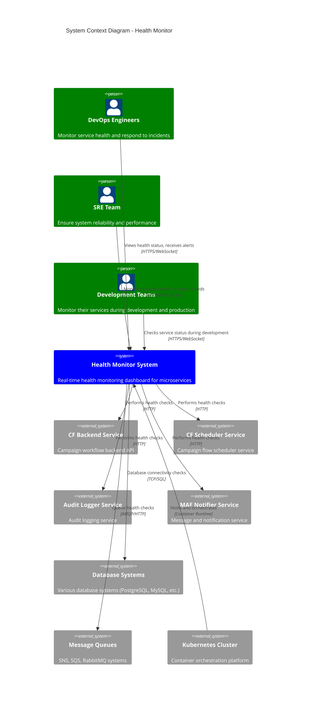

# C4 Context Diagram - Health Monitor System

## System Context

The Health Monitor System provides real-time monitoring and health checking capabilities for microservices infrastructure.

## Key Relationships

### Primary Users
- **DevOps Engineers**: Use the system to monitor production services and respond to incidents
- **SRE Team**: Analyze health trends and ensure system reliability
- **Development Teams**: Monitor their services during development and production deployments

### External Systems
- **Microservices**: CF Backend, CF Scheduler, Audit Logger, MAF Notifier
- **Infrastructure**: Databases, Message Queues (SNS, SQS, RabbitMQ)
- **Platform**: Kubernetes cluster for deployment and orchestration

### Communication Patterns
- **Real-time monitoring**: WebSocket connections for live updates
- **Health checks**: HTTP requests to service health endpoints
- **Database checks**: Direct database connectivity validation
- **Message queue checks**: Queue availability and performance testing